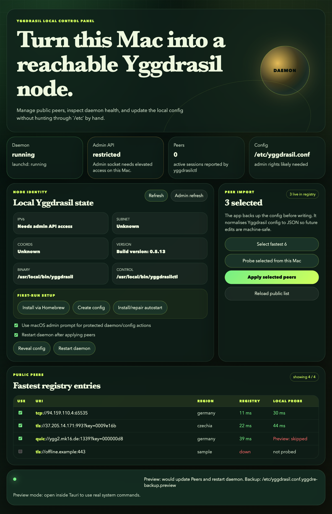

# Yggdre

Local-first GUI control panel for [Yggdrasil Network](https://yggdrasil-network.github.io/).

Yggdre helps configure and monitor a local Yggdrasil node on macOS: install/setup, config discovery, public peer import, peer probing, daemon restart, and node status.

> Status: macOS MVP. Linux and Windows support are planned later.



## Features

- Detect local `yggdrasil` and `yggdrasilctl` binaries.
- Show daemon, launchd, config, and admin API status.
- Fetch public peers from the public Yggdrasil peer registry.
- Select fastest live peers from the registry.
- Probe selected TCP/TLS/WS/WSS peers from this Mac.
- Write selected peers into the Yggdrasil config with backup.
- Restart the macOS `system/yggdrasil` LaunchDaemon.
- First-run setup actions:
  - install Yggdrasil via Homebrew;
  - create default config;
  - install/repair launchd autostart.

## Safety model

Yggdre is local-only:

- no cloud backend;
- no account system;
- no telemetry;
- no remote command service.

Privileged actions use a macOS administrator prompt. Config writes are limited to standard Yggdrasil config locations and create a backup before replacing the file.

Supported config paths:

- `/etc/yggdrasil.conf`
- `/etc/yggdrasil/yggdrasil.conf`
- `/usr/local/etc/yggdrasil.conf`
- `/opt/homebrew/etc/yggdrasil.conf`

## Requirements

- macOS
- Node.js 24+
- npm
- Rust/Cargo
- Xcode Command Line Tools

Optional but useful:

- Homebrew
- Yggdrasil Network package

## Development

Install dependencies:

```bash
npm install
```

Run desktop app in development mode:

```bash
npm run tauri:dev
```

Run frontend-only preview:

```bash
npm run dev
```

The frontend dev server binds to `127.0.0.1:1420`.

## Build

Build frontend:

```bash
npm run build
```

Build desktop app:

```bash
npm run tauri:build
```

Release binary is created at:

```bash
src-tauri/target/release/yggdre
```

Run release binary:

```bash
src-tauri/target/release/yggdre
```

## Verification

Current checks used during MVP development:

```bash
npm run build
cd src-tauri && cargo fmt --check
cd src-tauri && cargo check
npm run tauri:build
```

Manual QA covered:

- app launch;
- setup button flow in preview mode;
- peer selection;
- empty peer selection disables apply;
- selected peer probing;
- apply-preview flow;
- release binary smoke test.

## macOS notes

Yggdrasil commonly runs as a LaunchDaemon and uses a protected config file under `/etc`. Because of that:

- non-admin `yggdrasilctl` may show socket permission errors;
- config writes usually require admin approval;
- daemon restart usually requires admin approval.

Yggdre exposes this as `Admin API restricted` and provides admin actions where needed.

## Roadmap

- Better full config editor.
- Tray/menu bar mode.
- Linux service support.
- Windows service support.
- Packaging/signing/notarization.

## License

TBD.
